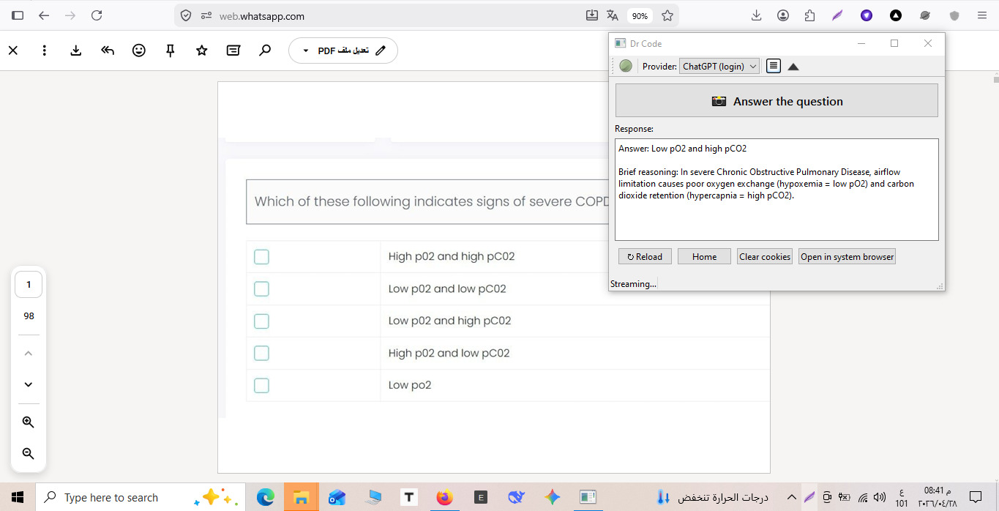

# Dr Code

A small desktop assistant disguised as an analog desk clock — or, if
you prefer, a digital clock, a battery icon, a Wi-Fi indicator, a
sticky note, a CPU bar, a weather widget, and so on (10 disguises
in total). Click the disguise while a question is on your screen
and the answer appears either in the title bar, in a tooltip, or
on the disguise itself, depending on which one you picked.

Each install requires a per-device **activation code** issued from
the **Dr Code Admin** Android app. Codes are bound to the first
device they're used on; admins can mint new codes, revoke them, or
unblock devices remotely.



## What it does

- The window looks like a regular always-on-top **analog clock** —
  the only thing visible to anyone behind you.
- **Click the clock face** (or press the global hotkey
  `Ctrl+Shift+A`) while your exam / question is on screen.
- Dr Code grabs a screenshot of your primary monitor, drops it into
  ChatGPT in a **hidden** browser session, types your default
  question, and reads the answer back.
- The answer is shown **in place of the window's title bar text** —
  so it just looks like a clock with a slightly long name.
- Right-click the clock face for the hidden controls (sign in to
  ChatGPT, calibrate / settings, pin on top, stop the clock).
- Sign in to ChatGPT once. The session stays logged in across
  restarts because cookies persist in `~/.drcode/`.

## Quick start (Windows)

The easiest way is to download the pre-built `.exe`. No Python, no
dependencies, no setup.

1. Go to the [latest Windows release](
   https://github.com/Dr-Code-EG/-Aura-AI/releases/tag/latest-windows).
2. Download `DrCode-windows-<…>.zip`.
3. Unzip anywhere (for example `C:\Users\You\DrCode`).
4. Double-click **`DrCode.exe`** — a small clock window appears.
5. **Sign in once.** Right-click the clock face, choose
   **Sign in to ChatGPT**, sign in (email + password is most
   reliable; some third-party providers reject embedded browsers),
   then right-click again and choose **Hide ChatGPT panel** to
   return to the clock. The ChatGPT browser stays mounted in the
   same window (collapsed to 1 px) so its JS bridge keeps working
   while you only see the clock.
6. Open your exam / question and **left-click the clock face** (or
   press `Ctrl+Shift+A`). The answer appears in the title bar of
   the clock window.

## Quick start (Android)

The Android version is the same idea — disguised as a clock, hidden
ChatGPT in the background, answer in a small dialog.

1. Go to the [latest Android release](
   https://github.com/Dr-Code-EG/-Aura-AI/releases/tag/latest-android).
2. Download `DrCode-android.apk` and open it on your phone (allow
   "Install unknown apps" if prompted).
3. Open the **Clock** app, tap **Sign in**, log in to ChatGPT once.
4. Tap **Start clock face** — a small live analog clock floats over
   other apps. Drag it anywhere; tap to ask.
5. Open your exam / question and tap the floating clock. Android
   asks once for capture permission, then the clock reads the screen
   and the answer pops up in a small dialog.

## Run from source

If you'd rather run from source — for development or a non-Windows
machine — you'll need Python 3.11+.

```bash
git clone https://github.com/Dr-Code-EG/-Aura-AI.git
cd -Aura-AI
python -m venv .venv
. .venv/bin/activate    # on Windows: .venv\Scripts\activate
pip install -r requirements.txt
python drcode.py
```

## Build a Windows .exe yourself

```bash
pip install -r requirements.txt
pip install pyinstaller
pyinstaller --noconfirm drcode.spec
```

The frozen build ends up at `dist/DrCode/DrCode.exe`. Distribute the
whole `dist/DrCode/` folder — the `.exe` needs the bundled
QtWebEngine runtime files for the hidden ChatGPT session.

## Activation & admin app

The first time you launch Dr Code on a machine you'll be asked for a
**16-character activation code** in the form `DRCD-XXXX-XXXX-XXXX`.
After a code is verified once, it's locked to that device — the same
code on a different machine prompts the user, accepts up to **5**
wrong-code attempts, and then permanently blocks that device until
an admin unblocks it.

The desktop client is **always online**: it re-checks every 60
seconds that the code hasn't been revoked and the device hasn't been
blocked, and shuts itself down within a minute if either changes.

The companion **Dr Code Admin** Android APK
(`DrCode-admin-android.apk`) lets you:

- mint new codes (single or in bulk),
- search the existing codes / devices table,
- reset a code back to "unused" (so the same code can move to a new
  PC if the user replaces hardware),
- revoke a code permanently,
- block or unblock individual devices.

To set up the admin side once:

1. In the [Firebase Console](https://console.firebase.google.com/)
   for project **drcode-ai**, enable **Authentication →
   Email/Password** and create an admin user.
2. Open **Firestore Database**, create the database, and paste the
   contents of [`firestore.rules`](firestore.rules) into the
   **Rules** tab.
3. Add a document at `admin_users/{your-uid}` (with any small
   payload, e.g. `{ email: "you@example.com" }`). The `uid` is
   visible under **Authentication → Users**. Documents in this
   collection are what the rules use to recognise admin accounts.
4. Install `DrCode-admin-android.apk`, sign in with the email and
   password you just created, and start generating codes.

## Settings

Right-click the clock and choose **Calibrate…** (or press `Ctrl+,`)
to change:

- The default question / instructions sent with every screenshot.
- The global hotkey.
- Whether the clock auto-hides while taking the screenshot.
- The hide-window delay (in milliseconds) before the screenshot is
  taken.
- **Appearance** — pick one of 10 disguises (analog clock, digital
  clock, status bar, battery, Wi-Fi, volume mixer, weather card,
  mini calendar, sticky note, CPU bar). Each disguise has its own
  best place to display the answer (title bar, tooltip, or inline
  text), so the surface you pick determines how the answer reaches
  you.

Settings and the hidden ChatGPT browser profile (cookies, session,
etc.) live in `~/.drcode/`.

## Project layout

```
.
├── desktop_app/                        # Python source for the app
│   ├── app.py                          # entry point
│   ├── overlay_window.py               # always-on-top clock window
│   ├── clock_widget.py                 # analog clock (QPainter)
│   ├── chatgpt_browser.py              # hidden ChatGPT browser
│   ├── capture.py                      # primary-screen screenshot
│   ├── hotkey.py                       # global hotkey listener
│   ├── settings_dialog.py              # settings UI
│   ├── settings_store.py               # ~/.drcode/config.json
│   ├── _qtwebengine_runtime_hook.py    # PyInstaller runtime hook
│   └── resources/chatgpt_inject.js     # JS bridge into chatgpt.com
├── drcode.py                           # `python drcode.py` launcher
├── drcode.spec                         # PyInstaller spec
├── requirements.txt
├── assets/screenshot.jpg
├── android/                            # Android (Clock) source
│   └── app/src/main/java/com/drcode/clock/
│       ├── ui/MainActivity.kt          # tiny home screen
│       ├── bubble/BubbleService.kt     # always-on-top floating clock
│       ├── bubble/ClockFaceView.kt     # live analog clock view
│       ├── capture/                    # MediaProjection one-shot
│       └── chatgpt/ChatGptActivity.kt  # hidden ChatGPT WebView + bridge
└── .github/workflows/                  # CI: build-windows.yml, build-android.yml
```

## License

All rights reserved.
